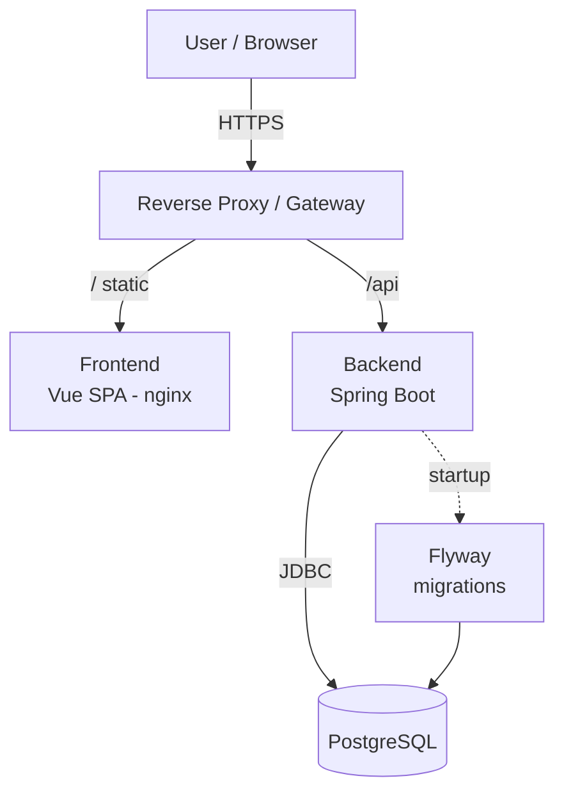
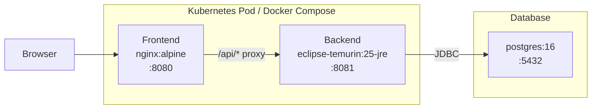
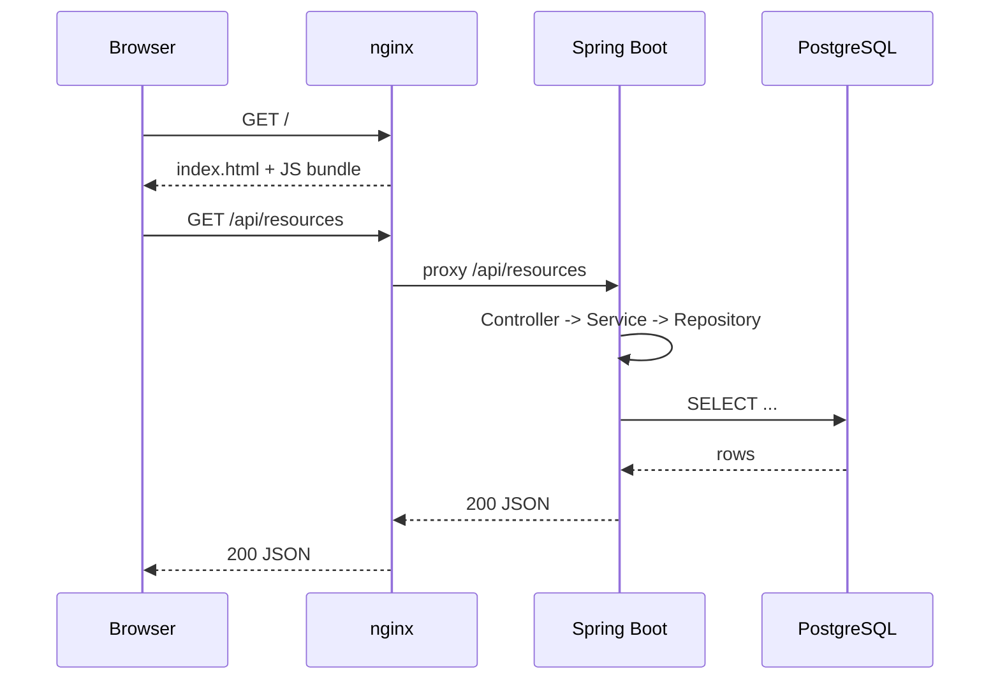
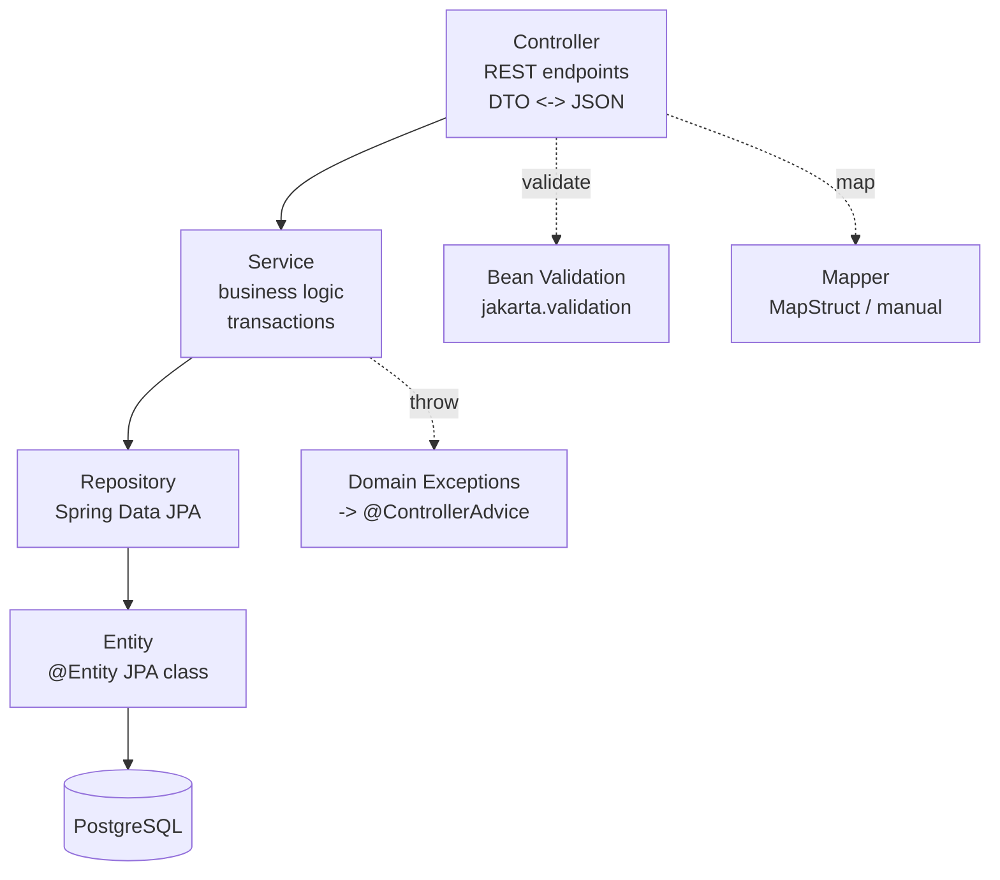
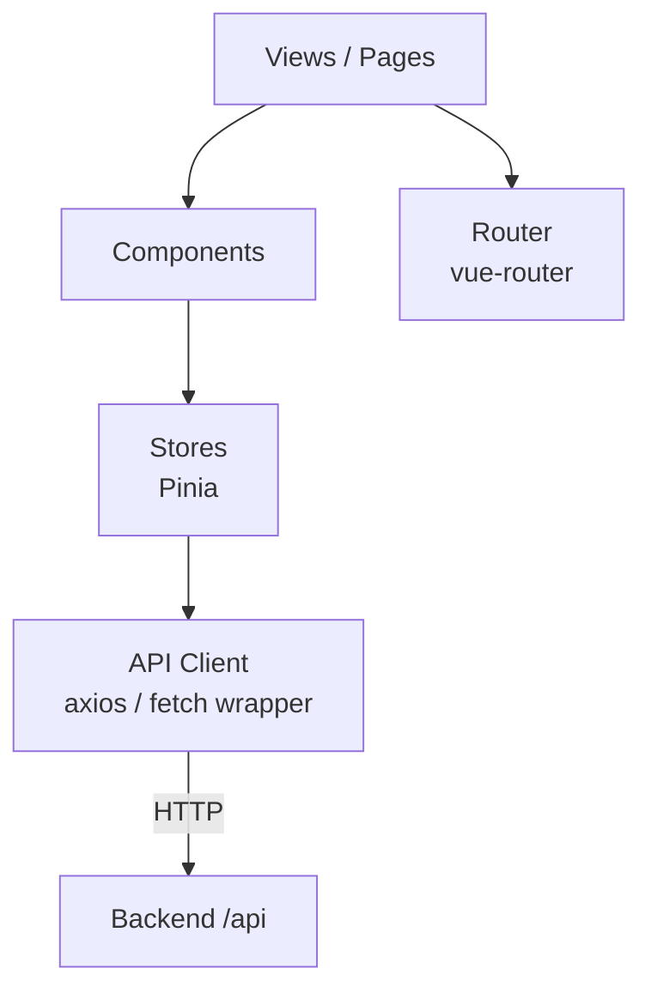
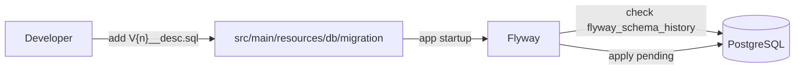
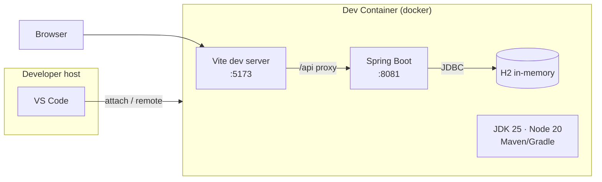
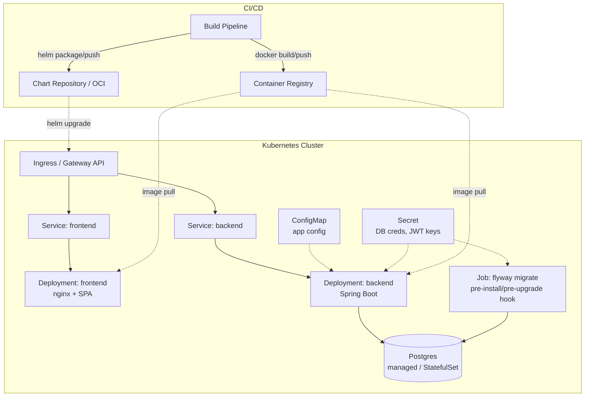

# Architecture Overview: Vue.js + Spring Boot + PostgreSQL + Flyway

A generic, reusable architecture reference for web applications built with a Vue 3 SPA frontend, a Spring Boot REST backend, PostgreSQL for persistence, and Flyway for schema migrations. This document is project-agnostic and can be dropped into any repository using the same stack.

## Stack Summary

| Layer          | Technology                                  | Responsibility                                   |
|----------------|---------------------------------------------|--------------------------------------------------|
| Frontend       | Vue 3, Vite, Pinia, Vue Router, Axios/Fetch | SPA, client-side routing, state, API calls      |
| Backend        | Spring Boot 4.x (Java 25), Spring Web       | REST API, business logic, validation, security  |
| Data Access    | Spring Data JPA, Hibernate                  | ORM, repositories, transactions                  |
| Migrations     | Flyway                                      | Versioned, forward-only schema evolution         |
| Database       | PostgreSQL 16                               | Relational persistence                           |
| Build          | Vite (frontend), Gradle/Maven (backend)     | Bundling and packaging                           |
| Runtime        | JVM + static asset server (nginx or Spring) | Serving the SPA and API                          |
| Packaging      | Docker (multi-stage)                        | Immutable container images for FE and BE         |
| Deployment     | Helm 3 chart on Kubernetes                  | Templated, versioned cluster deployment          |

## System Overview



The browser loads the Vue SPA from a static host (nginx or a CDN). The SPA calls the Spring Boot REST API under `/api`. Spring Boot persists data in PostgreSQL via JPA. On startup, Flyway applies any pending schema migrations before the application accepts traffic.

## Container View



Two common deployment shapes:

1. **Split containers** — nginx serves the SPA and proxies `/api/*` to Spring Boot. This scales the frontend independently and keeps static serving cheap.
2. **Single container** — Spring Boot serves the built SPA from `src/main/resources/static` and also exposes the API. Simpler to ship; couples frontend and backend lifecycles.

## Request Flow



## Backend Layering



- **Controller** — thin; handles HTTP concerns, validation, DTO mapping. No business logic.
- **Service** — transactional boundary (`@Transactional`). Orchestrates repositories, enforces invariants.
- **Repository** — `JpaRepository<Entity, Id>` interfaces; custom queries via `@Query` or Specifications.
- **Entity** — JPA-mapped domain model. Keep separate from DTOs exposed to the frontend.
- **DTO / Mapper** — isolate wire format from persistence model; avoid leaking JPA lazy-loading into JSON serialization.
- **@ControllerAdvice** — central exception-to-HTTP translation.

## Frontend Layering



- **Views** — route-level screens registered with vue-router.
- **Components** — reusable presentational and container components.
- **Stores (Pinia)** — application state, derived state, actions that call the API layer.
- **API client** — single module wrapping `axios` or `fetch`; centralizes base URL, auth headers, error normalization.
- **Composables** — reusable reactive logic (`useXxx`) extracted from components.

## Database Migrations (Flyway)



- Migrations live in `backend/src/main/resources/db/migration/`.
- Naming: `V<version>__<description>.sql` (e.g. `V1__init.sql`, `V2__add_users_table.sql`). Use an increasing version; prefer timestamp-based versions (`V20260410_1200__...`) on teams with parallel branches.
- **Forward-only.** Never edit an applied migration; add a new one to change schema.
- Repeatable migrations (`R__<name>.sql`) for views, functions, seed data that should re-run when their checksum changes.
- Flyway runs automatically on Spring Boot startup when `spring-boot-starter-flyway` is on the classpath.
- Production discipline: test migrations against a dump of production data in CI before release.

### Typical Configuration

```yaml
spring:
  datasource:
    url: jdbc:postgresql://${DB_HOST:localhost}:5432/${DB_NAME}
    username: ${DB_USER}
    password: ${DB_PASSWORD}
  jpa:
    hibernate:
      ddl-auto: validate   # never 'update' or 'create' in production
    properties:
      hibernate.dialect: org.hibernate.dialect.PostgreSQLDialect
  flyway:
    enabled: true
    baseline-on-migrate: true
    locations: classpath:db/migration
```

`ddl-auto: validate` ensures Hibernate verifies the mapped entities against the Flyway-managed schema and fails fast on drift — Flyway, not Hibernate, owns the schema.

## Local Development Topology

Development happens inside a **VS Code Dev Container** (`.devcontainer/`). The container is defined entirely via `devcontainer.json` using Dev Container Features — no custom `Dockerfile` needed. Host requirements collapse to Docker + VS Code + the Dev Containers extension.

Spring Boot runs against an **H2 in-memory database** in dev; Flyway applies migrations on startup automatically, so no external database process is needed.



### Dev Container Layout

```
.devcontainer/
└── devcontainer.json        # image, features, extensions, forwarded ports, postCreate
```

Typical `devcontainer.json` highlights:

- **`image`**: `mcr.microsoft.com/devcontainers/base:ubuntu` (or any suitable base — toolchain comes from features).
- **Features**: `ghcr.io/devcontainers/features/java:1` (pins JDK 25), `ghcr.io/devcontainers/features/node:1` (pins Node 20).
- **`forwardPorts`**: `5173` (Vite), `8081` (Spring Boot) — VS Code surfaces them on the host automatically.
- **`postCreateCommand`**: `./mvnw dependency:go-offline && (cd frontend && npm ci)` to warm caches on first open.
- **Extensions**: `vue.volar`, `vscjava.vscode-java-pack`, `redhat.vscode-yaml`.
- **Mounts**: bind-mount the workspace; keep `node_modules` and the Maven/Gradle cache on named volumes so rebuilds stay fast.

### Dev Profile Configuration

Activate a `dev` Spring profile that swaps in H2 and keeps Flyway enabled:

```yaml
# application-dev.yml
spring:
  datasource:
    url: jdbc:h2:mem:devdb;DB_CLOSE_DELAY=-1;MODE=PostgreSQL
    driver-class-name: org.h2.Driver
  jpa:
    hibernate:
      ddl-auto: validate        # Flyway owns the schema, not Hibernate
    database-platform: org.hibernate.dialect.H2Dialect
  flyway:
    enabled: true
    locations: classpath:db/migration
```

H2's `MODE=PostgreSQL` covers most SQL compatibility differences. Migrations that use PostgreSQL-specific DDL (e.g. `JSONB`, custom types) will need a fallback or can be tested against a real Postgres instance via Docker Compose (see below).

### Running the Stack

Inside the container terminal:

```bash
# Backend (hot reload via Spring Boot devtools)
SPRING_PROFILES_ACTIVE=dev ./mvnw spring-boot:run   # or: ./gradlew bootRun

# Frontend (Vite HMR)
cd frontend && npm run dev
```

- No external database needed — H2 starts in-process and Flyway migrates it on startup.
- `vite.config.ts` proxies `/api` to `http://localhost:8081`, so the SPA and API share an origin — no CORS setup needed in dev.
- Spring Boot devtools + `bootRun`/`spring-boot:run` gives live reload on the backend; Vite handles HMR on the frontend.

### Why a Dev Container

- **Reproducible toolchain** — JDK and Node versions are pinned via features, eliminating drift between developers and CI.
- **Zero-install onboarding** — a new contributor clones the repo, runs *Reopen in Container*, and has a working stack in minutes.
- **Isolation** — nothing is installed on the host; switching projects cannot break global versions.
- **Parity with CI** — the same features (or a close relative) can be used by CI jobs, so local failures reproduce in CI and vice versa.

### Docker Compose for Integration Testing

A `docker/docker-compose.yml` at the project root brings up a real PostgreSQL instance for integration tests and full-stack smoke runs. It is **not** tied to the dev container.

```
docker/
└── docker-compose.yml       # postgres service for integration / smoke testing
```

```yaml
# docker/docker-compose.yml
services:
  postgres:
    image: postgres:16
    environment:
      POSTGRES_DB: appdb
      POSTGRES_USER: app
      POSTGRES_PASSWORD: app
    ports:
      - "5432:5432"
    volumes:
      - pg_data:/var/lib/postgresql/data

volumes:
  pg_data:
```

Run it when you need Postgres-specific behaviour (e.g. JSONB queries, advisory locks) or before raising a PR:

```bash
docker compose -f docker/docker-compose.yml up -d
SPRING_PROFILES_ACTIVE=postgres ./mvnw verify   # integration tests against real Postgres
docker compose -f docker/docker-compose.yml down
```

Testcontainers in CI can spin up Postgres automatically, so this file is primarily a convenience for local integration runs.

### Example Vite Proxy

```js
// vite.config.ts
export default defineConfig({
  plugins: [vue()],
  server: {
    proxy: {
      '/api': { target: 'http://localhost:8081', changeOrigin: true },
    },
  },
})
```

## Suggested Project Layout

```
repo/
├── frontend/
│   ├── src/
│   │   ├── views/
│   │   ├── components/
│   │   ├── stores/          # Pinia
│   │   ├── composables/
│   │   ├── router/
│   │   └── api/             # axios client + typed endpoints
│   ├── vite.config.ts
│   └── package.json
├── backend/
│   ├── src/main/java/com/example/app/
│   │   ├── config/
│   │   ├── web/             # @RestController, @ControllerAdvice
│   │   ├── service/
│   │   ├── domain/          # @Entity
│   │   ├── repository/      # JpaRepository
│   │   └── dto/
│   ├── src/main/resources/
│   │   ├── application.yml
│   │   ├── application-dev.yml  # H2 + Flyway config for local dev
│   │   └── db/migration/        # Flyway SQL
│   └── build.gradle(.kts) | pom.xml
├── docker/
│   ├── Dockerfile.frontend
│   ├── Dockerfile.backend
│   └── docker-compose.yml       # Postgres for integration testing (not devcontainer)
├── .devcontainer/
│   └── devcontainer.json        # image + features (java, node), no Dockerfile
└── docs/
```

## Cross-Cutting Concerns

| Concern         | Typical Approach                                                                 |
|-----------------|----------------------------------------------------------------------------------|
| Authentication  | Spring Security + JWT or session cookies; Pinia store holds auth state           |
| Authorization   | Method security (`@PreAuthorize`) and/or request-level filters                   |
| Validation      | `jakarta.validation` on DTOs; `@Valid` in controllers                            |
| Error handling  | `@ControllerAdvice` returning RFC 7807 `application/problem+json`                |
| Logging         | SLF4J + Logback; JSON logs in prod; correlation IDs via MDC filter               |
| Config          | `application.yml` with profile-specific overlays + env vars for secrets          |
| Observability   | Spring Boot Actuator (`/actuator/health`, `/actuator/prometheus`) + Micrometer   |
| Testing         | JUnit 5 + Testcontainers (Postgres) for backend; Vitest + Vue Test Utils for FE  |
| CI              | Lint + unit tests + integration tests against Testcontainers Postgres            |

## Deployment

The target runtime is a **Kubernetes cluster**, and the application is shipped as a **Helm chart**. Docker Compose is used only for local full-stack development; the single-JAR option is a fallback for tiny environments.



### Helm Chart Layout

```
helm/<app>/
├── Chart.yaml
├── values.yaml
├── values-prod.yaml            # environment overlays
├── values-staging.yaml
└── templates/
    ├── _helpers.tpl
    ├── frontend-deployment.yaml
    ├── frontend-service.yaml
    ├── backend-deployment.yaml
    ├── backend-service.yaml
    ├── configmap.yaml
    ├── secret.yaml             # usually references external secret store
    ├── httproute.yaml          # or ingress.yaml
    ├── migration-job.yaml      # Flyway as a Helm hook
    └── serviceaccount.yaml
```

### Kubernetes Resources

| Resource                | Purpose                                                                 |
|-------------------------|-------------------------------------------------------------------------|
| `Deployment` (frontend) | nginx pods serving the Vue bundle; scales horizontally, stateless       |
| `Deployment` (backend)  | Spring Boot pods; stateless, horizontally scalable                      |
| `Service` (ClusterIP)   | Internal addressing for frontend and backend                            |
| `HTTPRoute` / `Ingress` | External routing: `/` → frontend, `/api` → backend                      |
| `ConfigMap`             | Non-secret config (profiles, feature flags, log levels)                 |
| `Secret`                | DB credentials, JWT signing keys — ideally sourced from a vault         |
| `Job` (Flyway)          | Runs migrations as a Helm `pre-install`/`pre-upgrade` hook              |
| `HorizontalPodAutoscaler` | CPU/memory-based scaling for both deployments                         |
| `PodDisruptionBudget`   | Maintains availability during node drains / rolling updates             |
| `NetworkPolicy`         | Restricts backend → DB and frontend → backend traffic                   |

### Migrations in Kubernetes

Running Flyway on every pod startup is risky once the backend scales beyond one replica: concurrent pods race for the schema lock, and a failing migration crashes every replica at once. Preferred patterns:

1. **Helm pre-upgrade Job** (recommended) — a dedicated `Job` runs `flyway migrate` before the new backend pods roll out. Disable Flyway in the Spring Boot app (`spring.flyway.enabled=false`) and keep `ddl-auto: validate` so pods fail fast on drift.
2. **Init container** — an init container runs migrations before the main container starts. Simple, but still runs per-pod; rely on Flyway's advisory lock to serialize.
3. **Leave Flyway in-process** — acceptable for single-replica backends and early-stage projects.

```yaml
# templates/migration-job.yaml (sketch)
apiVersion: batch/v1
kind: Job
metadata:
  name: {{ include "app.fullname" . }}-flyway
  annotations:
    "helm.sh/hook": pre-install,pre-upgrade
    "helm.sh/hook-weight": "-5"
    "helm.sh/hook-delete-policy": before-hook-creation,hook-succeeded
spec:
  backoffLimit: 1
  template:
    spec:
      restartPolicy: Never
      containers:
        - name: flyway
          image: flyway/flyway:10
          args: ["migrate"]
          env:
            - name: FLYWAY_URL
              value: jdbc:postgresql://$(DB_HOST):5432/$(DB_NAME)
            - name: FLYWAY_USER
              valueFrom: { secretKeyRef: { name: db-credentials, key: username } }
            - name: FLYWAY_PASSWORD
              valueFrom: { secretKeyRef: { name: db-credentials, key: password } }
          volumeMounts:
            - name: migrations
              mountPath: /flyway/sql
      volumes:
        - name: migrations
          configMap: { name: {{ include "app.fullname" . }}-migrations }
```

Alternatively, bake the SQL files into a dedicated migrations image built from the backend repo so the Job pulls versioned migrations from the registry instead of a ConfigMap.

### Health, Readiness, and Rollouts

- **Liveness probe** — `/actuator/health/liveness` (Spring Boot); restarts stuck pods.
- **Readiness probe** — `/actuator/health/readiness`; gates traffic until the JVM is warm and the DB pool is up.
- **Startup probe** — generous timeout for slow JVM starts; avoids liveness killing a pod mid-boot.
- **RollingUpdate** strategy with `maxUnavailable: 0` and a PDB for zero-downtime deploys.

### Environment Promotion

- One chart, multiple `values-<env>.yaml` overlays. Differences are confined to image tags, replica counts, resource requests/limits, ingress hostnames, and secret references.
- CI promotes the **same chart version + same image digest** from staging to prod; overlays change, artifacts do not.

### Other Deployment Shapes (Fallbacks)

- **Docker Compose** — local full-stack runs only. Not a production target.
- **Single JAR** — Spring Boot serves the built Vue bundle as static resources. Useful for tiny apps or demos; loses independent scaling and the Helm-based workflow.

## Scaling Notes

- **Frontend** — stateless, trivially horizontal. Cache aggressively behind a CDN.
- **Backend** — stateless request handling scales horizontally. Keep session state out of memory (use JWT or a shared session store).
- **Database** — vertical first. Add read replicas for read-heavy workloads; introduce connection pooling (HikariCP is default in Spring Boot) sized to the DB's `max_connections`.
- **Migrations under multiple replicas** — Flyway uses a database lock (`flyway_schema_history` + advisory lock) so concurrent startups are safe; still prefer running migrations as a dedicated pre-deploy job for large changes.
